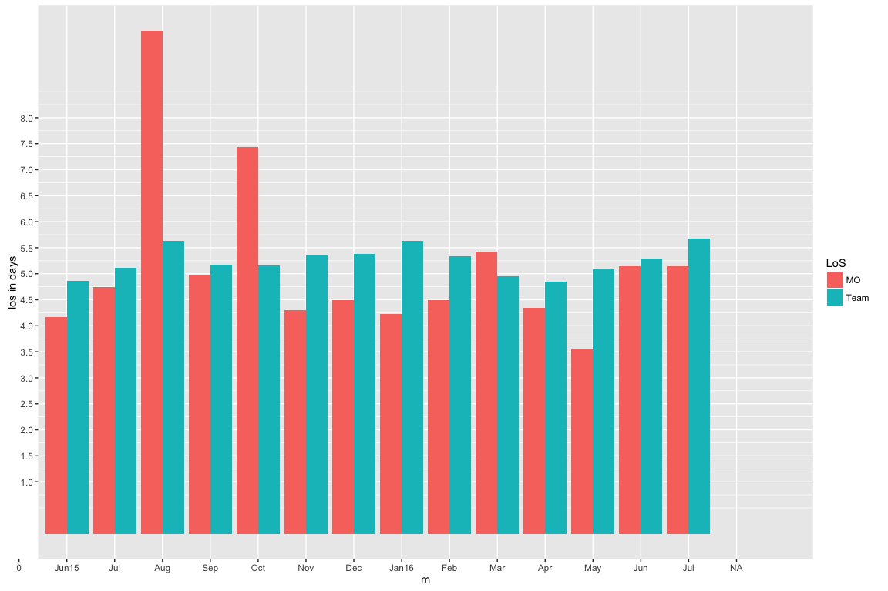
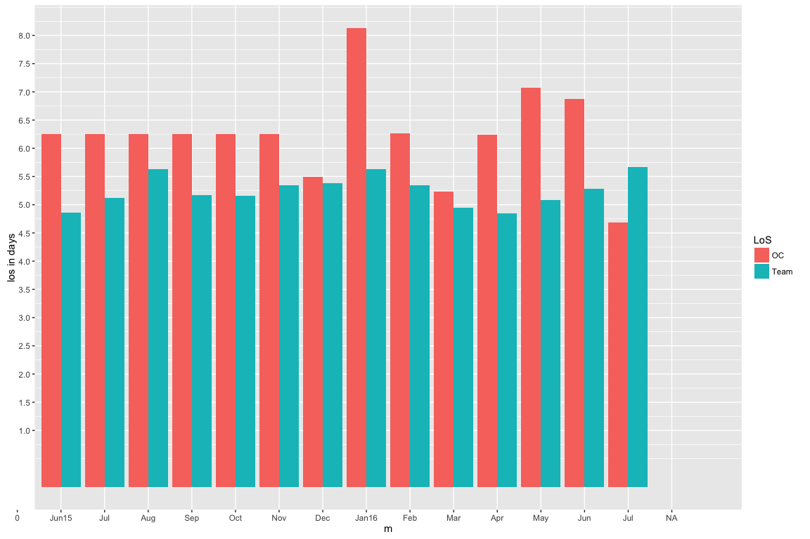
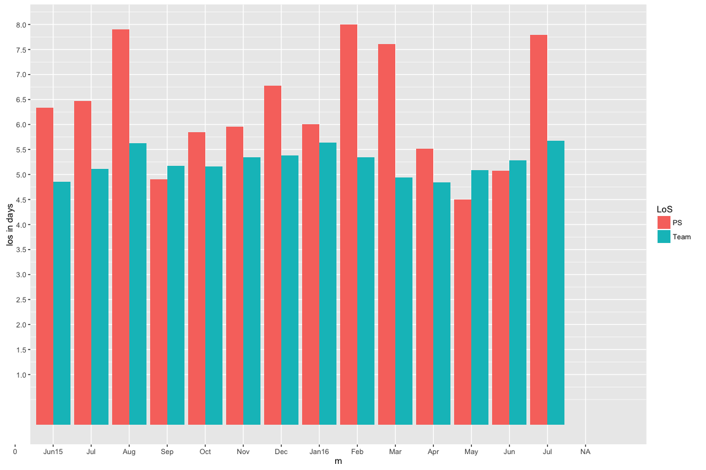

Lenght of Stay
================

### Length of stay for each Physician compared to the Mean of the Team for each month.

The purpose of this quick data exploration is to see if there's a statistically significant difference between the providers when it comes to the length of stay (los) from June 2015 to July 2016.

The 'los' numbers are different, but that begs the question: is that difference between the providers significant or just related to randomness?

For this end, I initially plot the 'los' for each provider side to side with the team's mean 'los' for each month from June 2015 to July 2016. This visualization gives a rough idea about each provider's performance.

Then, I use the ANOVA method to compare the means between the samples. There will be a total of 18 samples each reprensenting one Physician. Each sample has 14 observations corresponding to the mean of the 'los' for each month for each physician from June, 2015 to July, 2016 (14 months total).

The frame below is the source of plotting and analysing the data.

    ##         index   AJ   AR   BG   BA   BV   GS   KG   MO   MH   NS   OE   OC
    ## 1  2015-06-30 4.21 3.80 4.47 4.88 3.46 5.18 5.80 4.17 6.57 4.79 4.36 6.25
    ## 2  2015-07-31 4.00 4.02 5.54 6.69 4.75 6.15 4.00 4.74 6.14 4.79 5.80 6.25
    ## 3  2015-08-31 5.16 4.45 5.07 6.14 5.20 4.74 5.33 9.67 7.18 4.79 4.97 6.25
    ## 4  2015-09-30 3.48 4.00 4.95 7.78 6.28 4.76 3.78 4.98 7.00 4.31 6.02 6.25
    ## 5  2015-10-31 3.95 3.77 5.86 6.61 5.58 4.65 3.87 7.44 6.76 4.24 4.53 6.25
    ## 6  2015-11-30 5.08 5.02 3.46 5.51 6.61 5.33 4.42 4.30 6.10 5.13 4.84 6.25
    ## 7  2015-12-31 6.40 5.36 4.98 7.65 5.70 5.80 4.42 4.49 5.54 5.05 3.47 5.49
    ## 8  2016-01-31 4.56 6.08 4.85 6.57 4.56 5.25 4.42 4.22 7.07 4.38 6.81 8.13
    ## 9  2016-02-29 5.11 4.02 4.13 4.83 7.83 5.27 5.83 4.50 5.67 4.33 5.52 6.27
    ## 10 2016-03-31 5.94 3.96 3.74 4.38 4.63 5.87 3.87 5.42 5.95 4.22 4.81 5.23
    ## 11 2016-04-30 4.71 4.40 3.75 4.76 8.41 4.93 3.89 4.35 5.40 5.93 4.38 6.24
    ## 12 2016-05-31 4.56 5.40 5.05 6.02 4.89 4.18 5.27 3.54 5.39 5.04 4.48 7.07
    ## 13 2016-06-30 5.26 3.09 3.00 5.52 6.19 5.38 4.89 5.15 6.23 4.84 6.41 6.88
    ## 14 2016-07-31 4.47 3.92 3.73 5.59 5.10 6.28 7.83 5.15 5.94 5.26 5.11 4.69
    ##      PM   PS   RR   SR   TS   ZM
    ## 1  4.54 6.33 4.32 4.53 5.29 4.47
    ## 2  4.38 6.47 4.53 4.28 4.75 4.82
    ## 3  5.07 7.90 3.88 4.53 5.65 5.33
    ## 4  4.20 4.91 4.07 5.72 5.68 4.87
    ## 5  4.36 5.85 3.68 6.25 4.32 4.96
    ## 6  5.11 5.96 3.31 6.75 6.68 6.35
    ## 7  5.19 6.78 3.97 5.40 4.93 6.15
    ## 8  4.65 6.00 4.21 5.75 6.19 7.74
    ## 9  4.24 8.00 4.93 4.86 4.23 6.55
    ## 10 3.67 7.61 4.05 4.00 5.30 6.38
    ## 11 4.58 5.51 3.74 4.35 4.18 3.66
    ## 12 5.67 4.50 5.24 4.56 4.94 5.76
    ## 13 4.25 5.07 3.45 4.16 6.93 8.45
    ## 14 4.78 7.79 6.88 6.57 4.97 8.00

### Barplots for each physician compared to the team's mean 'los'.

AJ bar chart
------------

AR bar chart
------------

BG bar chart
------------

BA bar chart
------------

BV bar chart
------------

GS bar chart
------------

KG bar chart
------------

    ## <ScaleContinuousPosition>
    ##  Range:  
    ##  Limits:    0 --    1

MO bar chart
------------

MH bar chart
------------

NS bar chart
------------

OE bar chart
------------

OC bar chart
------------

PM bar chart
------------

PS bar chart
------------

RR bar chart
------------

SO bar chart
------------

TS bar chart
------------

ZM bar chart
------------

Mean of Length of Stay by ascending order
-----------------------------------------

    | RR    4.304286
    | AR    4.377857
    | BG    4.470000
    | PM    4.620714
    | AJ    4.777857
    | NS    4.793636
    | KG    4.830000
    | OE    5.107692
    | SR    5.122143
    | MO    5.151667
    | GS    5.269286
    | TS    5.288462
    | BV    5.656429
    | BA    5.923571
    | ZM    5.963571
    | MH    6.210000
    | OC    6.250000
    | PS    6.334615

### Using ANOVA and Tukey HSD

In order find out if there's a significant difference between the above 18 physicians, I used the ANOVA method to compare the means of the different 18 samples. As mentioned above each sample represents one physician with 14 values each corresponding to the 'los' for one month (total of 14 months). The P value (depicted below as Pr(&gt;F)) returned was 1.31 \* 10 to the power -12, which was way smaller than the treshold of 0.05. This indicates that there's a significant difference between At Least TWO means of the 18 samples.

Now a post hoc test called Tukey's HSD was conducted in order identify which samples differ significantly (by comparing all possible combinations of sample pairs-meaning comparing each provider with the other). It amounts to a total of 153 combinations or commparisons.

For instance if we have 3 samples (P1,P2,P3), there will be 3 total combinations: P1 compared with P2, P1 compared with P3 and P2 compared with P3.

In our case of 18 samples, we have 153 combinations to compare. TukeyHSD identified an overall significant difference between the bottom 8 providers compared with the first 10.

    ##              Df Sum Sq Mean Sq F value   Pr(>F)    
    ## ind          17  105.6   6.210   6.531 1.31e-12 ***
    ## Residuals   234  222.5   0.951                     
    ## ---
    ## Signif. codes:  0 '***' 0.001 '**' 0.01 '*' 0.05 '.' 0.1 ' ' 1

After I eliminated providers with length of stay exceeding 5.2, I ran ANOVA again on the remaining dataset of 10 physicians. This time the P value defined below as *Pr(&gt;F)* was 0.141 indicating that the 'los' difference between the remaining physician is NOT significant (P less than 0.05 is usually the treshold for significance) and is likely due to randomness.

    ##              Df Sum Sq Mean Sq F value Pr(>F)
    ## ind           9  12.16  1.3513   1.538  0.141
    ## Residuals   130 114.19  0.8784

### Conclusion

Shortfalls of this data analysis:

This data exploration is in no way comprehensive or conclusive. In order to run ANOVA, the 'los' variable for each sample should have a normal distribution. I assumed 'los' follows a normal distribution since it's related to a human behavior. In order to run ANOVA, the missing values for providers who were not working on certain months, were replaced by the mean of their 'los' computed from the months when they were working. The data might be unfair for some providers like Dr. BA and OC whose 'los' has been improving over the last few months (it is not unusual for someone who newly joined the team to have high 'los' in the first few months). The data might be unfair to people who had more float rotations and therefore carried more ICU patients compared to people who had more geographical rotations especially if they had more rotations on the Neurology unit.

I was always suspicious that there's an inter-physician difference in performance and if there is, it could merely be a random observation. This data doesn't prove or disprove that, however it shows that there's a significant difference between a physician with an 'los' of 4.5 and one with an 'los' higher than 6.2; and this particular finding may not be related solely to randomness.
